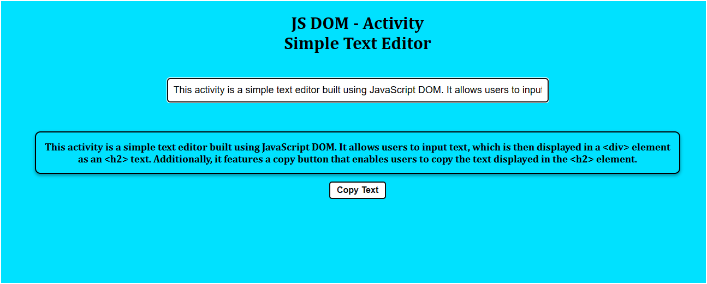

# JS DOM - Activity - Simple Text Editor

## Overview

This activity is a simple text editor built using JavaScript DOM. It allows users to input text, which is then displayed in a `
` element as an `<h2>` text. Additionally, it features a copy button that enables users to copy the text displayed in the `<h2>` element.

## Preview

## How it Works

- Users can input text in the provided text field.
- As soon as the user types in the input field, the entered text is dynamically displayed in the `
` element as an `<h2>` text.
- Users can click the "Copy Text" button to copy the text displayed in the `<h2>` element to the clipboard.

## Technologies Used

- HTML
- CSS
- JavaScript DOM

## Usage

1. Open the `index.html` file in a web browser.
2. Enter text in the input field.
3. The entered text will be dynamically displayed in the `
` element as an `<h2>` text.
4. Click the "Copy Text" button to copy the text displayed in the `<h2>` element to the clipboard.
